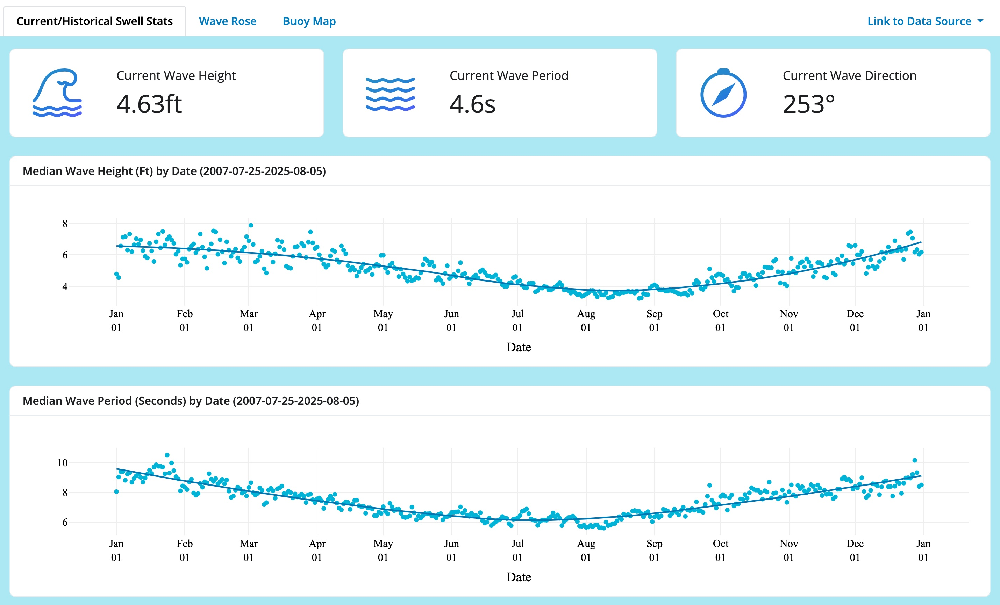
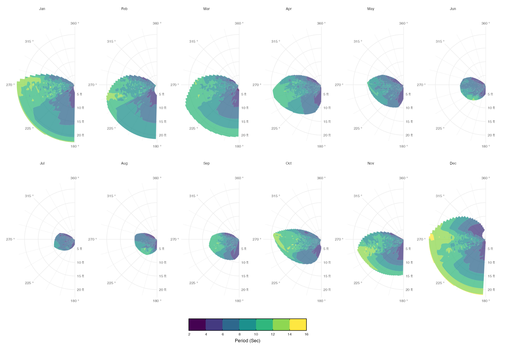
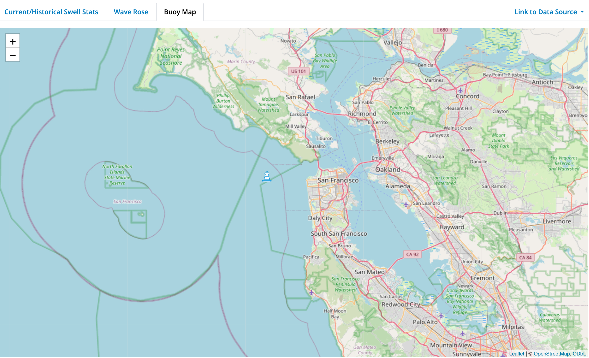

# WaveViewer
### San Francisco Swell Visualizer

**See current swell characteristics, and visual historical swell trends**

**Wave roses provide a visual summary of ocean swell by showing the frequency and direction of wave energy, helping users quickly understand dominant swell patterns over time.**

**Location information on the buoy providing the information**

